# ECG Monitoring Device Prototype Simulated in Proteus**

---

## 1. Overview

The goal of this project is to design and simulate  **ECG monitoring system** using hobby-grade components (Arduino Uno, TFT ILI9341 display, basic op-amps).

**Key features:**
- 3-electrode configuration (LA, RA, RL) with **Right Leg Drive (RLD)**  
- Signal conditioning: instrumentation amplifier + bandpass filtering  
- Biasing to 0.55 V for Arduino's 1.1 V internal reference  
- Real-time processing: BPM (instant & average), R amplitude, QRS width, RR interval, HRV (SDNN, RMSSD)  
- Visual output on TFT display  

**Simulation environment:** Proteus  

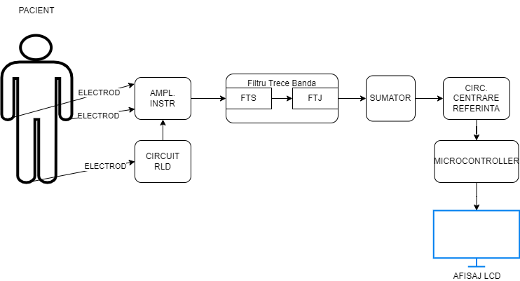  

---

## 2. Hardware – Signal Conditioning

### Main components
- **Signal generation**: Python script (Gaussian waves for P-QRS-T + 50 Hz noise)  
- **Patient model**: Equivalent ECG siganl generator using text file and with applied noise 
- **Instrumentation amplifier**: AD620 (gain ~100)  
- **Right Leg Drive (RLD)**: TL082 op-amp → common-mode noise rejection  
- **Filtering**: Sallen-Key bandpass (0.05 Hz high-pass + 26 Hz low-pass, Butterworth-like)  
- **Offset correction & bias**: TL082 summer (-20 mV offset trim) + voltage divider to 0.55 V (**1.1 V internal reference**) (for ADC centering at ~512 ADC counts)  

### ECG signal aquisition and processing chain
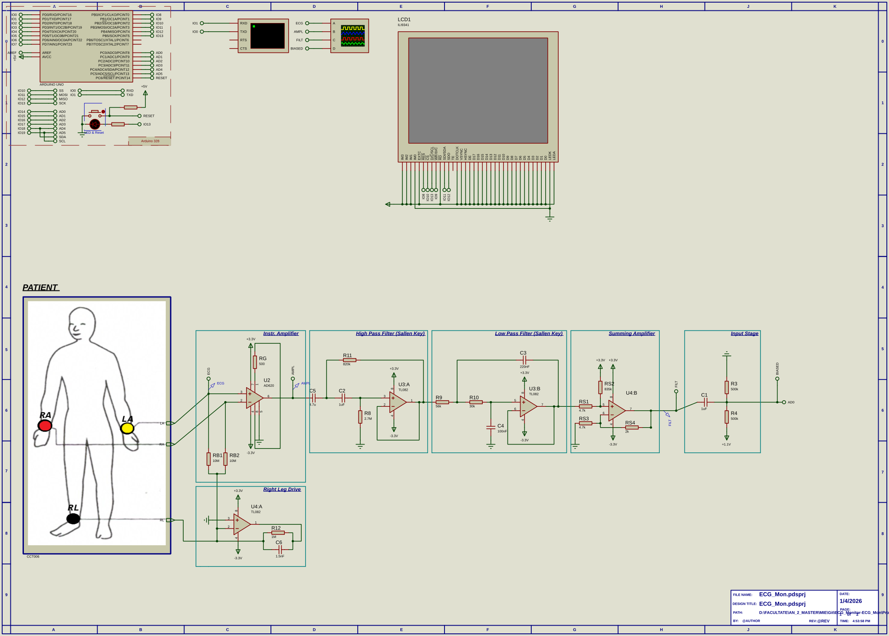  
*(Simplified block diagram of analog front-end)*

---

## 3. Software

### Core architecture
- **Microcontroller**: Arduino Uno  
- **Sampling**: Timer1 interrupt @ 1 kHz (precise 1000 Hz)  
- **Data acquisition**: Circular buffer (250 samples)  
- **Filtering**: Simple IIR high-pass for baseline wander removal  
- **R-peak detection**: Derivative-based + adaptive threshold  
- **Calculations**:
  - Instant & EMA-averaged BPM  
  - QRS width (threshold crossing)  
  - RR intervals  
  - HRV: SDNN, RMSSD  
- **Display**: TFT ILI9341 – real-time waveform + numeric panel (BPM, R amp, QRS, RR, HRV)

### Main processing loop
- Read from buffer  
- Apply baseline filter  
- Detect R-peak  
- Update statistics (EMA smoothing)  
- Refresh display every 1 s

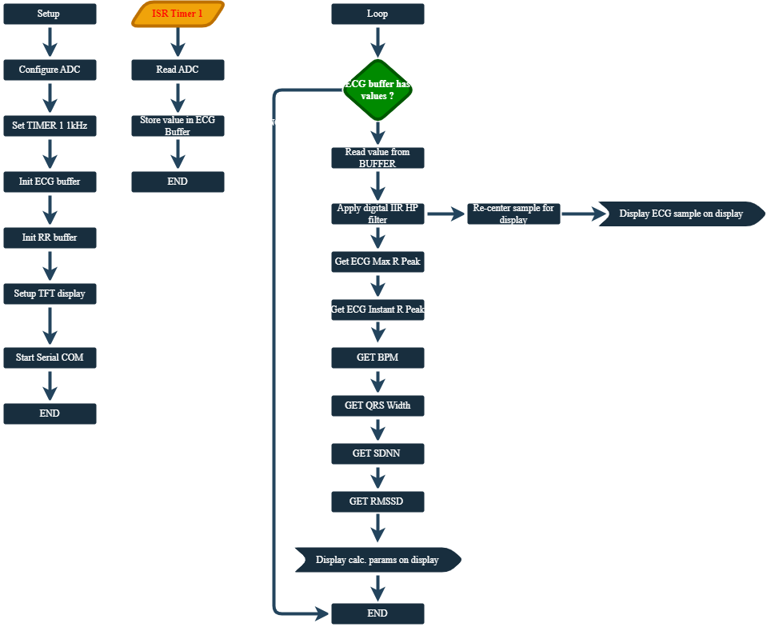  
*(Simplified software flowchart)*

### 🧠 Algorithms & Signal Processing Logic
Detailed breakdown of the software logic used for R-peak detection and clinical metrics calculation.

<table>
  <tr>
    <td align="center">
       
      <b>Peak Detection</b> (1st Derivative & Adaptive Thresholding logic)
    </td>
  </tr>
  <tr>
    <td align="center">
      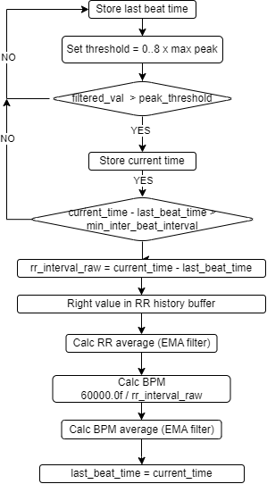 
      <b>BPM Logic</b> (Real-time pulse calculation and RR intervals)
    </td>
  </tr>
  <tr>
    <td align="center">
      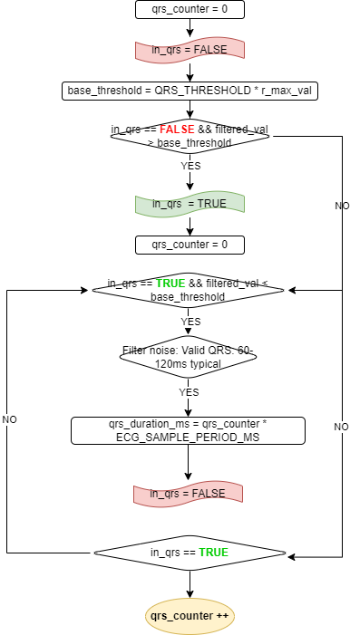 
      <b>QRS Analysis</b> (Time-domain measurement of the ventricular complex)
    </td>
  </tr>
</table>

> [!NOTE]  
> The algorithms are optimized for the **ATmega328P** single-core architecture, utilizing a 1kHz Timer Interrupt to ensure sampling precision while maintaining a 10ms UI refresh rate.

---

## 4. Demo / Results

Two main simulation scenarios were tested in Proteus to validate the system:

### Scenario 1: Clean Signal (Low Noise)
- Stable heart rate ≈ 80 BPM  
- Low HRV values (SDNN ≈ 24 ms, RMSSD ≈ 41 ms)  
- QRS duration ≈ 100 ms  
- Excellent R-peak detection and clean waveform  

**Clean Signal – 4-view comparison**

<table>
  <tr>
    <td align="center">
      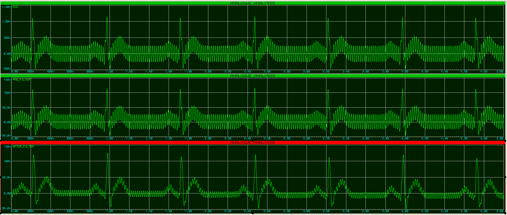 
      <b>Analysis Overview</b> (Clean waveform after amplification and filtering - Analog analisys)
    </td>
    <td align="center">
      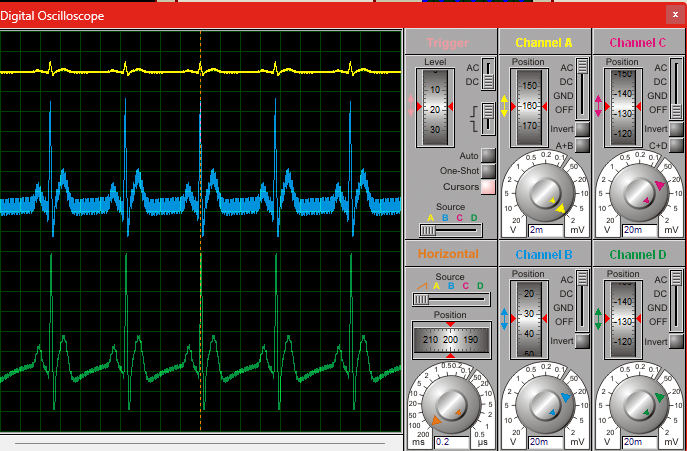 
      <b>Oscilloscope View</b> (Clean waveform after amplification and filtering - Scope view)
    </td>
  </tr>
  <tr>
    <td align="center">
      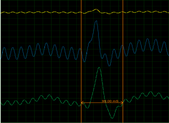 
      <b>Zoom on Oscilloscope</b> (Detailed QRS complex)
    </td>
    <td align="center">
      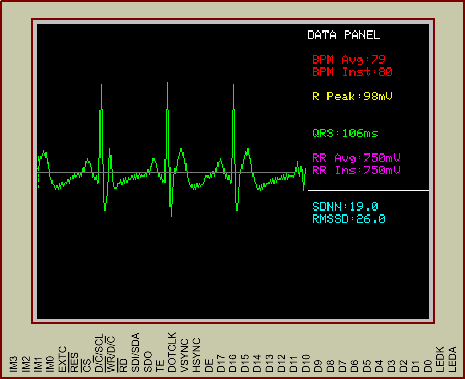 
      <b>TFT Display Output</b> (Live waveform + numeric panel)
    </td>
  </tr>
</table>

### Scenario 2: Noisy Signal (with 50 Hz + artifacts)
- BPM correctly detected (~78–82 BPM)  
- Elevated HRV due to artifacts (SDNN ≈ 70 ms, RMSSD ≈ 115 ms)  
- Filtering still allows reliable QRS detection  
- Baseline wander and noise visible before/after processing  

**Clean Signal – 4-view comparison**

<table>
  <tr>
    <td align="center">
      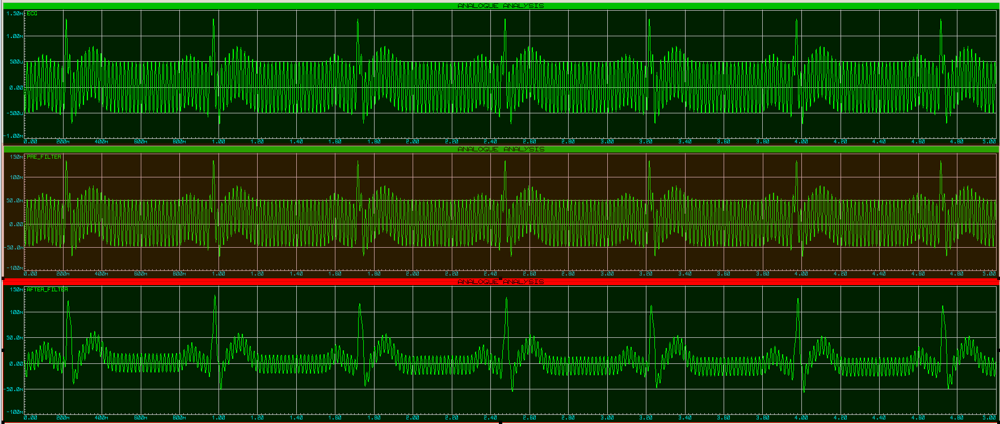 
      <b>Analysis Overview</b> (Noisy waveform after amplification and filtering - Analog analisys)
    </td>
    <td align="center">
      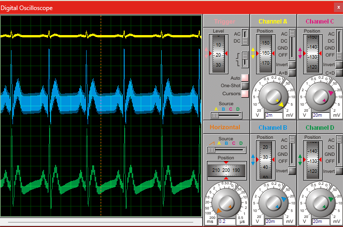 
      <b>Oscilloscope View</b> (Noisy waveform after amplification and filtering - Scope view)
    </td>
  </tr>
  <tr>
    <td align="center">
      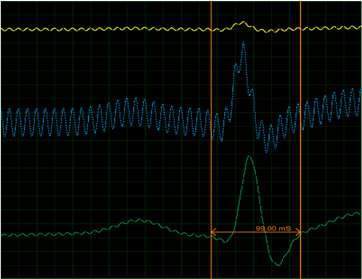 
      <b>Zoom on Oscilloscope</b> (Detailed QRS complex)
    </td>
    <td align="center">
      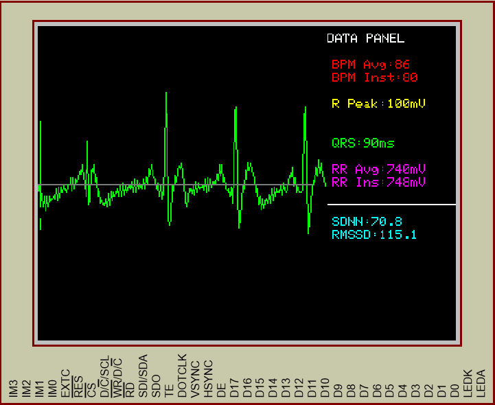 
      <b>TFT Display Output</b> (Live waveform + numeric panel)
    </td>
  </tr>
</table>

